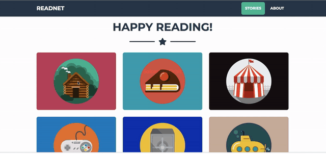

# A recommender app for free short stories

The aim of development of this application is to develop a portal where anyone could go in and read for free.The reason they are free is that they are in public domain and have been maintained and aggregated by outstanding volunteer effort at [project guttenberg](https://www.gutenberg.org/).

Before you start using this repo I would highly recommend reading the accomapanied [tutorial blog](https://medium.com/analytics-vidhya/tutorial-on-development-of-an-ai-engine-for-recommending-great-short-stories-2e136b3afa27) that I wrote .It has a detailed explanation of context and explanation.

## End to end development

There are six stage of development that need to be followed:

- Content creation
- Development of recommendation algorithm
- Development of backend database for storing text based recommendations
- Development of backend API to serve short stories and recomendations
- Development of a front end user interace for a great user experience
- Deployment of the webapp on Heroku

## Step-1:Content creation

All of the short stories on readnet are free from copyright as that is the only way we could make it available no charge for the userbase. One of the largest repository for free out of copyright books and stories is [project guttenberg](https://www.gutenberg.org/) .<b>All the content that you would find on the site has been extracted from Project Gutenberg(Please consider a small [donation](https://www.gutenberg.org/wiki/Gutenberg:Project_Gutenberg_Needs_Your_Donation) to this outstanding initiative)<b>.
